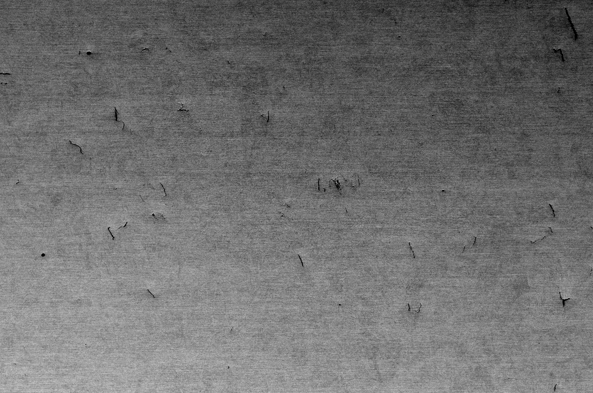

## Overview

**ImageAnalysis App** is a Python-based application designed for object recognition and image processing. It utilizes computer vision techniques and machine learning algorithms to identify and analyze objects within images. The application incorporates multiple scripts for database connectivity, image processing, and data handling.

## Features
- **CSV Data Loading and Processing**: Load CSV files and convert data into appropriate formats.
- **Database Connection**: Establishes a connection to a MariaDB database using credentials from a configuration file.
- **Image Processing**: Utilizes OpenCV for various image processing tasks, including shadow removal and image normalization.
- **Interactive Data Handling**: Provides functionality for converting data in pandas DataFrame to float and handles different statistical calculations.

## Components
1. **`main.py`**:
   - Main entry point of the application.
   - Manages CSV data handling and database connectivity.
   - Uses `df_toFloat` function to ensure all data in the DataFrame is converted to floats.
2. **`gnrl_database_con.py`**:
   - Handles database connection using the MariaDB connector.
   - Reads database credentials from an external text file.
   - Contains helper functions to validate text input and interact with the database.
3. **`additional_scripts.py`**:
   - Contains image processing utilities such as `shadow_remove` to clean and normalize images by removing shadows.
   - Utilizes OpenCV and NumPy for efficient image processing.
4. **`img_processing.py`**:
   - Includes functions for displaying images and processing images using morphological operations.
   - Leverages OpenCV, `skimage`, and `scipy` libraries for advanced image processing techniques.

App results:
Input image:

Objects contours image:
